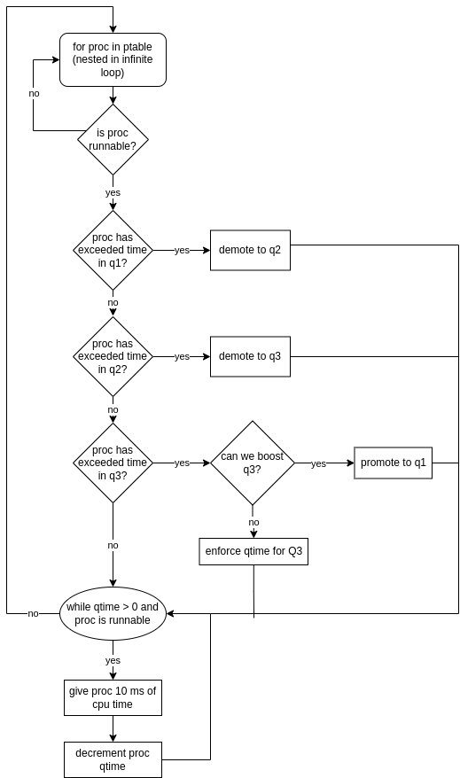

# Programming 2 (P2): Revised MLFQ Scheduler

Instructor: Dr. Shengquan Wang

Student: Nate Pierce, University of Michigan Dearborn

CIS 450 Operating Systems

# Overview
This project takes the existing round robin (RR) scheduler for the xv6 operating system and implements a multi-level feedback queue (MLFQ) for the scheduler.

The per-process scheduler will have three queues, with three priorities. The highest priority, Q1, has a quantum size of 10 ms. The next queue, Q2, has a quantum size of 30 ms. The third and lowest queue, Q3, has a quantum size of 90 ms. Processes that exceed the quantum time in the third queue may be boosted back to Q1 three times. After the final boost, the process must finish in queue three. Processes that exceed the quantum time at each queue level will be demoted to the next lower queue.

# Building
Clone the repo, `cd` into the build directory. Within the docker container, use `make` and `make qemu-nox` to build and open the xv6 shell.

# Testing
Run `spin 10000000 &; spin 10000000 &; spin 10000000 &;` within the xv6 shell to launch three spin processes.

# Implementation

The implemention is done by utilizing the existing round robin for loop within the scheduler which iterates over all processes in the ptable. I added code which selects the proper process to run. If the process is runnable, and if there are not other processes in higher priority queues to run, then run the process. Before the process is actually run, demotions and boosts are handled. Finally, the process runs for the alloted quantum size specified by p->quantumsize. All processes are added to Q1 upon initialization, and run for 10 ms. By doing it this way, I can leverage the time interrupt xv6 uses, so that approximately 10 ms with each iteration of the while loop (which is where the process gets cpu time and context switching occurs). 

To proc.h, add queuetype, boosted counter, and quantum time.


```
enum procstate { UNUSED, EMBRYO, SLEEPING, RUNNABLE, RUNNING, ZOMBIE };

// Per-process state
struct proc {
  uint sz;                     // Size of process memory (bytes)
  pde_t* pgdir;                // Page table
  char *kstack;                // Bottom of kernel stack for this process
  enum procstate state;        // Process state
  int pid;                     // Process ID
  struct proc *parent;         // Parent process
  struct trapframe *tf;        // Trap frame for current syscall
  struct context *context;     // swtch() here to run process
  void *chan;                  // If non-zero, sleeping on chan
  int killed;                  // If non-zero, have been killed
  struct file *ofile[NOFILE];  // Open files
  struct inode *cwd;           // Current directory
  char name[16];               // Process name (debugging)
  int queuetype;               // Queue number in rMLFQ
  int boosted;
  int quantumTime;
};
```

Within allocproc() in proc.c: 

```
  p->state = EMBRYO;
  p->pid = nextpid++;
  p->queuetype = 1;
  p->quantumCounter = 0;
  p->boosted = 0;
  p->quantumTime = 1;
  release(&ptable.lock);

```

Finally, most changes were made within the scheduler() function of proc.c

```
void
scheduler(void)
{
  struct proc *p;

  for(;;){
    // Enable interrupts on this processor.
    sti();

    // initialize queue occupancy count
    int q1occupied = 0;
    int q2occupied = 0;

    // Loop over process table looking for process to run. Each iteration is ~10 ms
    acquire(&ptable.lock);
    for(p = ptable.proc; p < &ptable.proc[NPROC]; p++){
      // select correct next proc to run
      if(p->state != RUNNABLE)
        continue;
      if (p->queuetype == 1)
        q1occupied++;
      if (p->queuetype != 1 && q1occupied > 0)
        continue;
      else if (p->queuetype != 2 && q2occupied > 0)
        continue;

      // handle demotions and boosts
      if (p->queuetype == 1 && p->quantumTime == 0) {
        p->queuetype = 2;
        p->quantumTime = 3;
        q2occupied++;
      }
      else if (p->queuetype == 2 && p->quantumTime == 0) {
        p->queuetype = 3;
        p->quantumTime = 9;
      }
      else if (p->queuetype == 3 && p->quantumTime == 0) {
        // check if proc can be boosted
        if (p->boosted < 3) {
          p->queuetype = 1;
          p->quantumTime = 1;
          p->boosted++;
          q1occupied++;
        }
        else {
          p->quantumTime = 9;
        }
      }

      // give proc cpu time if it is still running and hasn't exceeded quantum time
      while (p->quantumTime > 0 && p->state != ZOMBIE) {
        // set running proc
        proc = p;
        // Switch to chosen process.  It is the process's job
        // to release ptable.lock and then reacquire it
        // before jumping back to us.
        switchuvm(p);
        p->state = RUNNING;
        swtch(&cpu->scheduler, proc->context);
        switchkvm();

        // output only should go here
        if (p->state == ZOMBIE)
          cprintf("Process %s %d has finished \n", p->name, p->pid);
        if ((strncmp(p->name, "sh", 2) == 0 || strncmp(p->name, "spin", 4) == 0) && p->state != ZOMBIE) {
          cprintf("Process %s %d has consumed 10 ms in Q%d \n", p->name, p->pid, p->queuetype);
        }

        p->quantumTime--;
        // Process is done running for now.
        // It should have changed its p->state before coming back.
        proc = 0;
      }
      
      // update queue occupancy count for procs that have finished
      if (p->state == ZOMBIE) {
        if (p->queuetype == 1) {
          q1occupied--;
        }
        if (p->queuetype == 2) {
          q2occupied--;
        }
      }
    }
    release(&ptable.lock);

  }
}
```

The diagram below is the diagram for determining demotions and priority boosts, however there is additional logic here, particularly the code to determine which process to run next.

